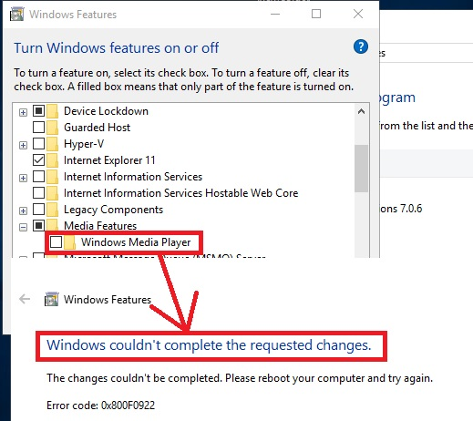

# DESCRIPTION
This patch fixes a bug with the inability to disable Windows Media Player. For Windows 10 only.

How to use:

Run as Administrator OffWMP.exe file.

OR

Run as Administrator OffWMP.bat file. The SetACL.exe file must be in the same folder as the bat-file.

